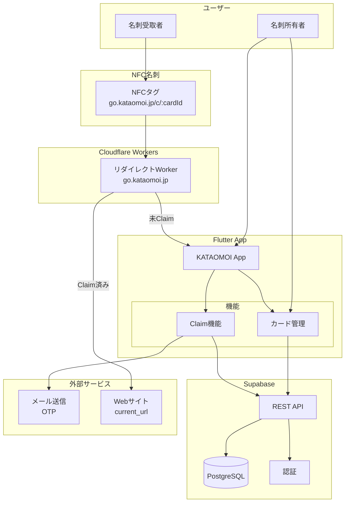
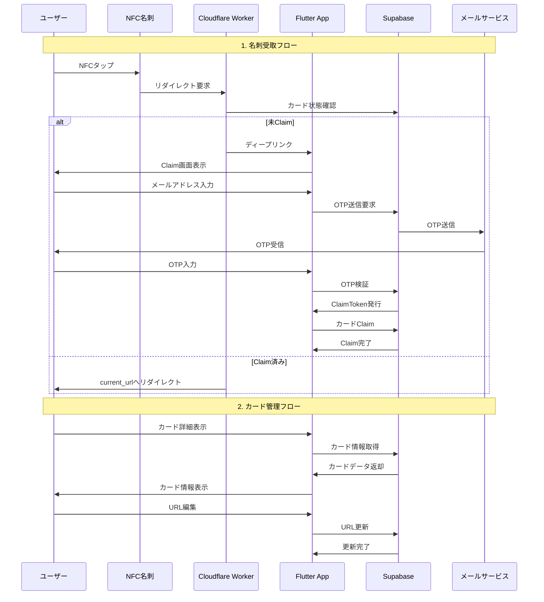

# KATAOMOI APP

KATAOMOI向け「NFC名刺の行き先を後から変えられる」MVPアプリケーションです。
Flutter + Supabase + Cloudflare Workersで構築されています。

## 機能概要

- **受け取り承認**: メールOTP → 1回限りClaimToken → owner割当
- **カード管理**: 名刺のcurrent_urlの表示・編集（保存で即反映）
- **リダイレクト**: 短縮URL `/c/:cardId` で未Claimならアプリのディープリンク、Claim済みならcurrent_urlへ302リダイレクト

## アーキテクチャ

- **Clean Architecture**: 依存関係の方向を制御し、ビジネスロジックを中心に据える
- **Feature-First**: 機能ごとにモジュールを分離し、スケーラブルな構造を実現
- **Domain-Driven Design**: ビジネスドメインを中心とした設計

### システム構成図



### データフロー



## セットアップ手順

### 1. Supabaseプロジェクトの設定

1. [Supabase](https://supabase.com)でプロジェクトを作成
2. SQL Editorで `supabase/schema.sql` を実行
3. `supabase/seed.sql` を実行して初期データを投入
4. RLS（Row Level Security）が有効化されていることを確認

### 2. Cloudflare Workersの設定

1. [Cloudflare](https://cloudflare.com)でアカウントを作成
2. `go.kataomoi.jp` ドメインを設定
3. Workers & Pagesで新しいWorkerを作成
4. `workers/redirect/src/index.ts` のコードをデプロイ
5. Worker Secretsに以下を設定：
   - `SUPABASE_URL`: SupabaseプロジェクトのURL
   - `SUPABASE_SERVICE_ROLE`: SupabaseのService Role Key
   - `APP_DEEP_LINK_SCHEME`: `kataomoiapp`
   - `FALLBACK_URL`: `https://kataomoi.jp/safety`

### 3. Flutterアプリの設定

1. `.env.example` を `.env` にコピー
2. `.env` ファイルにSupabaseの設定を記入：
   ```
   SUPABASE_URL=https://your-project.supabase.co
   SUPABASE_ANON_KEY=your-anon-key
   APP_DEEP_LINK_SCHEME=kataomoiapp
   GO_DOMAIN=https://go.kataomoi.jp
   FALLBACK_URL=https://kataomoi.jp/safety
   ```
3. 依存関係をインストール：
   ```bash
   flutter pub get
   ```
4. アプリを起動：
   ```bash
   flutter run
   ```

## フォルダ構成

```
lib/
├── main.dart                 # アプリのエントリーポイント
├── app/                     # アプリ全体の設定
├── core/                    # 共通機能・設定
│   ├── constants/           # アプリ定数・環境変数
│   ├── errors/             # エラーハンドリング
│   ├── network/            # ネットワーク設定
│   ├── theme/              # テーマ設定
│   └── utils/              # ユーティリティ
├── features/               # 機能別モジュール
│   ├── cards/              # カード管理機能
│   │   ├── data/           # データ層
│   │   ├── domain/         # ドメイン層
│   │   └── presentation/   # プレゼンテーション層
│   ├── claim/              # カードClaim機能
│   │   ├── data/           # データ層
│   │   ├── domain/         # ドメイン層
│   │   └── presentation/   # プレゼンテーション層
│   └── home/               # ホーム機能
├── shared/                 # 共通コンポーネント
│   ├── widgets/            # 再利用可能なウィジェット
│   ├── models/             # 共通モデル
│   └── services/           # 共通サービス
└── l10n/                   # 国際化ファイル

supabase/
├── schema.sql              # データベーススキーマ
└── seed.sql                # 初期データ

workers/
└── redirect/
    ├── src/
    │   └── index.ts        # Cloudflare Worker
    └── wrangler.toml       # Worker設定
```

## API仕様

### Claim関連
- `POST /claim/start` - メールOTP送信開始
- `POST /claim/verify` - OTP検証してClaimToken取得
- `POST /cards/:cardId/claim` - ClaimTokenでカードをClaim

### カード関連
- `GET /cards/:cardId` - カード情報取得
- `PATCH /cards/:cardId/destination` - カードURL更新

## 受け入れ基準

- [x] 新規Card作成時に `current_url = org_settings.default_url` が入る
- [x] `/c/:cardId`：`status=preprovisioned` → `myapp://claim?card=:cardId` に302
- [x] Claim完了後 `/c/:cardId` → `current_url` に302
- [x] モバイルアプリで `current_url` を編集 → 以降のアクセスに即反映
- [x] `current_url` 未設定時は `FALLBACK_URL` へ302

## 製造時の手順

1. `cards` テーブルにカードを作成（`current_url` は自動で `org_settings.default_url` が設定される）
2. NDEFに `https://go.kataomoi.jp/c/<cardId>` を書き込み
3. カード配布

## 技術スタック

- **フロントエンド**: Flutter (Dart)
- **バックエンド**: Supabase (PostgreSQL)
- **リダイレクト**: Cloudflare Workers
- **状態管理**: Riverpod
- **HTTP通信**: Dio
- **ディープリンク**: uni_links
